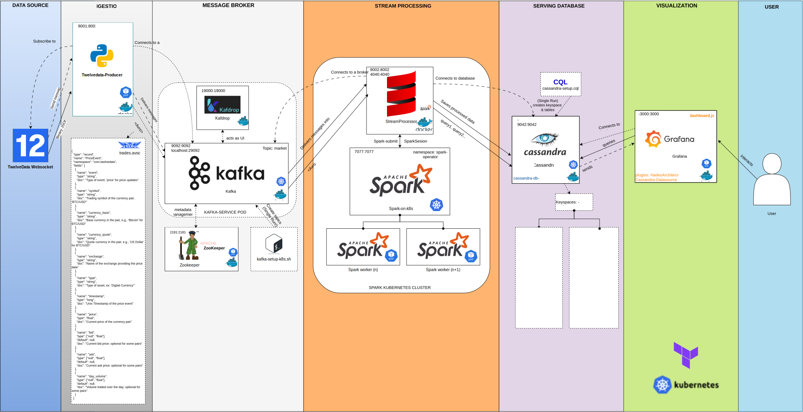

# **MarketDataStreamPipeline**

## **Overview**
**MarketDataStreamPipeline** is a scalable, real-time data pipeline designed to process and visualize market data from the TwelveData's websocket API. This architecture integrates multiple powerful components:
- **Apache Kafka** for reliable message brokering
- **Apache Spark** for data processing
- **Cassandra** for distributed storage
- **Grafana** for visualization
- **Kubernetes** for container orchestration
- **Terraform** for infrastructure provisioning

This repository will provides all the code, configuration, and instructions needed to deploy and operate the pipeline.

---

## **Architecture**

### **Data Flow**
1. **Ingestion**: The pipeline ingests real-time data from the TwelveData WebSocket API using a custom Python producer.
2. **Message Broker**: Kafka acts as the message broker, handling data distribution between ingestion and processing stages.
3. **Stream Processing**: Apache Spark processes the streaming data to perform transformations and analytical computations.
4. **Serving Database**: Processed data is stored in a Cassandra database, allowing for efficient querying and storage at scale.
5. **Visualization**: Grafana is configured to visualize the data stored in Cassandra, providing real-time insights and dashboards.
6. **Infrastructure Management**: The entire pipeline runs on Kubernetes, with Terraform scripts for automated provisioning and configuration.

---

## **Sprint Overview**
The development of this pipeline is organized into several sprints, each focusing on a specific part of the system.

**Sprint 1: Data Source and Ingestion Setup.**
-  Implement the TwelveData-Producer service for data ingestion.
-  Define Avro schema and integrate Avro encoding.
-  Dockerize the TwelveData-Producer service.

**Sprint 2: Kafka Message Broker and UI Management.**
-  Configure Kafka and Zookeeper, set up topics, and integrate with Kadrop UI.
-  Test producer-consumer data flow in Kafka.

**Sprint 3: Stream Processing with Apache Spark on Kubernetes.**
-  Deploy Spark on Kubernetes, connect Spark to Kafka, and process data for storage in Cassandra.

**Sprint 4: Database Setup and Integration with Cassandra.**
-  Set up Cassandra on Kubernetes, define keyspaces and tables, and integrate with Spark.

**Sprint 5: Visualization with Grafana.**
-  Configure Grafana with Cassandra as the data source, and design initial dashboards for real-time data monitoring.

**Sprint 6: Testing, Monitoring, and User Feedback.**
-  Conduct end-to-end testing, set up monitoring, and gather user feedback to enhance the dashboards.

---
