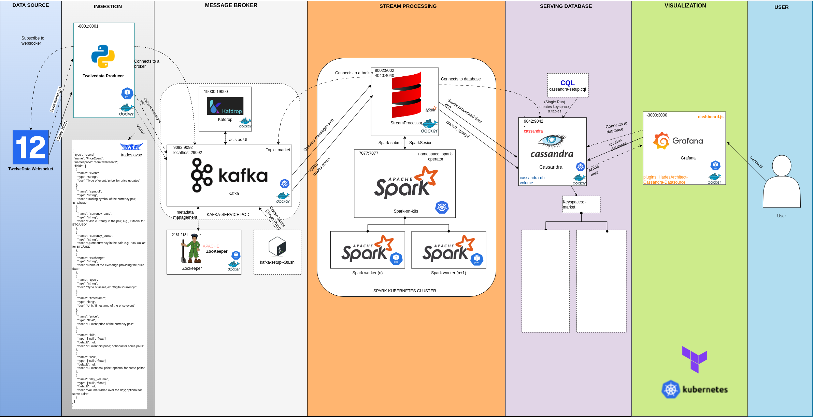

# RealTimeMarketDataPipeline
RealTimeMarketDataPipeline is a robust, end-to-end real-time data pipeline designed for processing and visualizing market data from TwelveData’s WebSocket API.

This architecture leverages Apache Kafka for message brokering, Apache Spark for real-time stream processing, Cassandra for scalable data storage, and Grafana for visualization.

The project is containerized using Docker and orchestrated on Kubernetes, making it scalable, flexible, and suitable for cloud deployment. Infrastructure provisioning and management are automated with Terraform, simplifying deployment and scaling across various environments.

Here's a detailed README.md for the first version of your project:

---

# **MarketDataStreamPipeline**

## **Overview**
**MarketDataStreamPipeline** is a scalable, real-time data pipeline designed to process and visualize market data from the TwelveData API. This architecture integrates multiple powerful components:
- **Apache Kafka** for reliable message brokering
- **Apache Spark** for data processing
- **Cassandra** for distributed storage
- **Grafana** for visualization
- **Kubernetes** for container orchestration
- **Terraform** for infrastructure provisioning

This repository provides all the code, configuration, and instructions needed to deploy and operate the pipeline.

---

## **Architecture**

### **Data Flow**
1. **Ingestion**: The pipeline ingests real-time data from the TwelveData WebSocket API using a custom Python producer.
2. **Message Broker**: Kafka acts as the message broker, handling data distribution between ingestion and processing stages.
3. **Stream Processing**: Apache Spark processes the streaming data to perform transformations and analytical computations.
4. **Serving Database**: Processed data is stored in a Cassandra database, allowing for efficient querying and storage at scale.
5. **Visualization**: Grafana is configured to visualize the data stored in Cassandra, providing real-time insights and dashboards.
6. **Infrastructure Management**: The entire pipeline runs on Kubernetes, with Terraform scripts for automated provisioning and configuration.

---

## **Project Structure** (In Progress)
